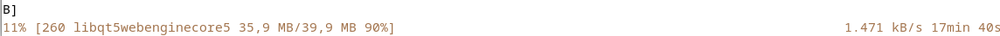

# FILE LAINNYA

[BACK](../README.md)

# TUGAS 3

## LINUX APT COMMAND 

### FOR USER

|Command | Description |
|--------|:------------|
|``apt show foo``| Menampilkan informasi paket foo|
|``apt search foo``| Mencari paket bernama/berkaitan foo|
|``apt-cache policy foo``| Menampilkan versi tersedia paket foo|

### Command apt untuk ADMINISTRATOR

__Pastikan__ menggunakan ``sudo`` untuk menjalankan perintah berikut (root)

|Command | Description |
|--------|:------------|
|``apt update``| Update repository metadata (list versi dll)|
|``apt install foo``| Memasang paket foo dan yang terkait|
|``apt upgrade``| Menghapus versi lama paket|
|``apt full-upgrade``| Mengupdate/hapus paket yang beneran terbaru|
|``apt remove foo``| menghapus paket foo, tidak confignya|

### HOW TO USE APT COMMAND

Mengubah Repository Apt (pastikan gunakan sudo)

setelah melakukan update dan upgrade untuk depedency

Kita bisa install aplikasi menggunakan Aplikasi Software Bawaan

atau menggunakan KDE Installer, 

Informasi lengkap tentang Package Bisa diakses melalui link berikut :
[kde-full](https://wiki.debian.org/KDE#KDE.27s_software_in_Debian)
