# FILE LAINNYA

[BACK](../README.md)

# TUGAS 3

Daftar Isi
- [Soal 1 ](#1-installasi-paket)
- [Soal 2 (Mikrotik)](#2-subneting-pada-mikrotik)


## 1. Installasi Paket
### LINUX APT COMMAND 

### FOR USER

|Command | Description |
|--------|:------------|
|``apt show foo``| Menampilkan informasi paket foo|
|``apt search foo``| Mencari paket bernama/berkaitan foo|
|``apt-cache policy foo``| Menampilkan versi tersedia paket foo|


### Command apt untuk ADMINISTRATOR

__Pastikan__ menggunakan ``sudo`` untuk menjalankan perintah berikut (root)

|Command | Description |
|--------|:------------|
|``apt update``| Update repository metadata (list versi dll)|
|``apt install foo``| Memasang paket foo dan yang terkait|
|``apt upgrade``| Menghapus versi lama paket|
|``apt full-upgrade``| Mengupdate/hapus paket yang beneran terbaru|
|``apt remove foo``| menghapus paket foo, tidak confignya|


### HOW TO USE APT COMMAND

Mengubah Repository Apt (pastikan gunakan sudo)


setelah melakukan update dan upgrade untuk depedency

Kita bisa install aplikasi menggunakan Aplikasi Software Bawaan


atau menggunakan KDE Installer, 


Informasi lengkap tentang Package Bisa diakses melalui link berikut :
[kde-full](https://wiki.debian.org/KDE#KDE.27s_software_in_Debian)


### Melihat Storage Yang terpakai di Linux Menggunakan TERMINAL

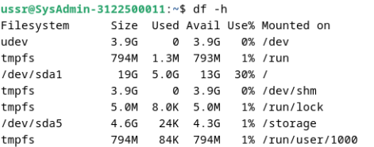
### Membuat daftar Directory, diurutkan dari yang terbesar ke yang terkecil
Melihat isi direktori dengan perintah du dan sort (satuan megabyte):

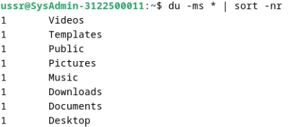
### NCurses Disk Usage (ncdu)
Untuk menganalisis ruang disk dalam mode konsol dengan menggunakan perintah ncdu.

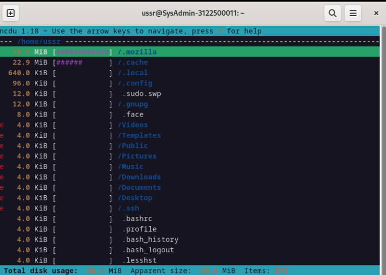
### baobab
Digunakan untuk menganalisa ruang pada disk dengan tampilan grafis.

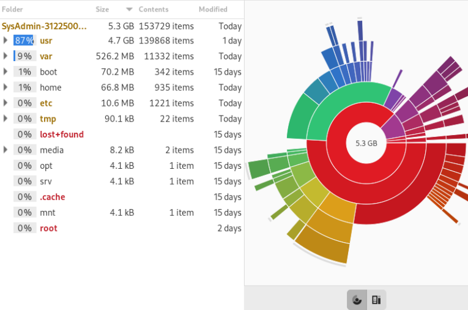
### Membersihkan Paket
#### Apt/aptitude/dpkg 
 Manajer paket Debian yang biasa digunakan. Saat menginstal sebuah paket, file sumber arsip/debnya disimpan di sistem pada folder /var/cache/apt/archives/ untuk memungkinkan kemungkinan instalasi ulang tanpa koneksi Internet. 
 
 Untuk membersihkan cache apt gunakan perintah apt clean.

Setelah cache dari paket yang diinstal dibersihkan, Kita juga dapat menghapus paket yang tidak berguna dari sistem, serta file konfigurasi. Peringatan! Ingatlah untuk memeriksa dengan cermat daftar paket yang direncanakan untuk dihapus, sebelum menerima operasi:

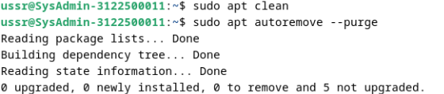

Jika Anda telah mengupgrade sistem Anda, ada kemungkinan beberapa paket tidak lagi tersedia di repositori baru (paket tersebut sudah usang). Untuk membuat daftar dan menghapus paket-paket ini, gunakan apt dan periksa dengan cermat daftar paket yang direncanakan untuk dihapus:

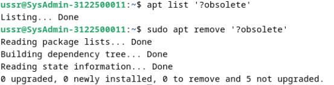
### 
Terakhir, untuk membuat daftar dan membersihkan file konfigurasi yang tetap ada meskipun aplikasi telah dihapus, gunakan perintah berikut :

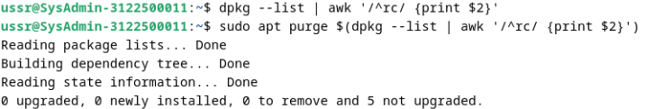
#### deborphan 
Mencantumkan paket-paket yang diadopsi pada sistem : paket-paket yang tidak bergantung pada paket lain. 

Ingatlah untuk memeriksa dengan cermat daftar paket yang direncanakan untuk dihapus, sebelum menjalankan operasi.

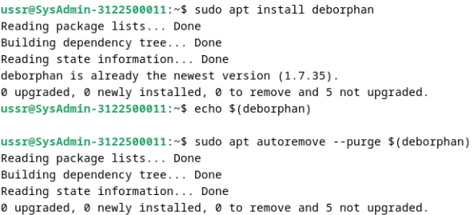
### Mengosongkan trash-bin
Tiga trash-bin (wastebasket) yang berbeda harus dipertimbangkan:

#### trash-bin user
Anda dapat mengosongkannya dengan system file manager atau dengan perintah :

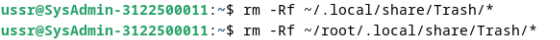
#### trash-bin admin
Untuk mengosongkannya dengan cara yang benar, gunakan terminal dalam mode administrator:


#### trash-bin eksternal
biasanya diberi nama '/media/(loginname)/your_disk/.Trash_1000'.


## Menginstall Package EXTERNAL Extensi .deb

#### DEBI Application

Kita dapat menginstall package External (.deb) menggunakan aplikasi Gdebi yang dapat diinstall dengan cara berikut.


Sekarang kita coba melakukan installasi untuk paket dari aplikasi VSCODE

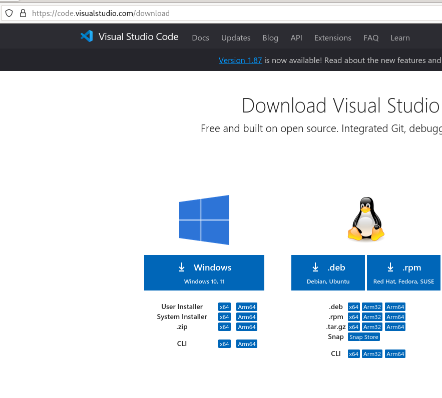

pastikan paket berextensi .deb

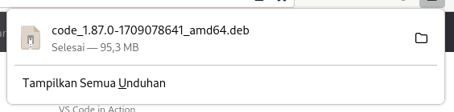


Langkah-Langkah :
1. Buka Gdebi
2. Buka File .deb


3. Disini jika file sudah terpilih kita dapat melihat detail paketnya


4. Paket akan dipasang

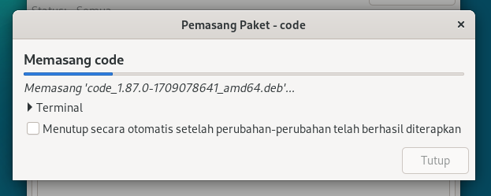

5. paket selesai diinstall

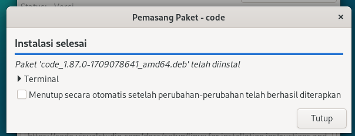


6. cara remove package

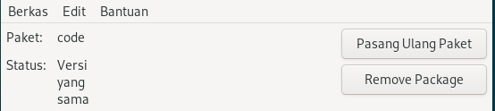

#### Menggunakan Terminal (dpkg command)

1. Buka terminal    

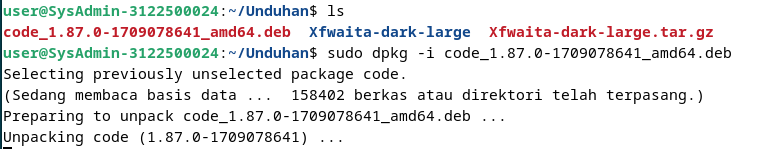

2. gunakan dpkg -i namapaket.deb untuk memasang

3. untuk melakukan uninstall gunakan dpkg --purge namaapp


## 2. Subneting Pada Mikrotik


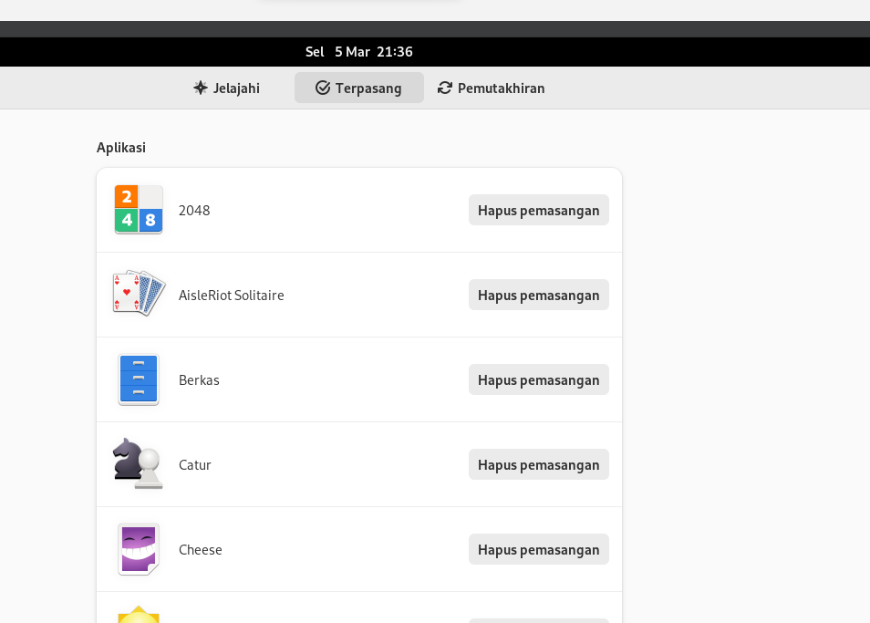

```
Router 6
Network 192.168.88.0
Int G0/1 192.168.88.254
Subnet 255.255.255.0
```

```
Router 5
Network 192.168.88.0
Int G0/0 192.168.88.2
Int G0/1 192.168.2.1
Subnet 255.255.255.0
```


```
End Device ( DHCP )
Ipv4 192.168.2.2 - 192.168.2.254
```

Mengatur Subnet pada Mikrotik
1. Buka terminal pada komputer lab dan masukkan perintah ip addr.
2. Lakukan reset configuration pada mikrotik hingga ip berubah kembali menjadi 192.168.88.102.
3. Pasang kabel WLAN pada laptop anda.
4. Pasang dan jalankan Winbox pada laptop anda. 
5. Connect pada physical address (MAC) yang ada di layar winbox. Dengan cara mengklik MAC address kemudian klik connect. Jika terdapat pesan error, pergi ke tools, pilih legacy mode, lakukan connect kembali. 
6. Nantinya akan muncul pesan configuration, pilih remove configuration.
7. Pertama-tama untuk mengecek level mikrotik, cari 'System' di sidebar dan pilih License. Mikrotik yang digunakan memiliki level 5. 
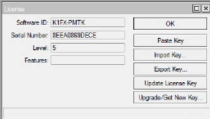
8. Untuk menambahkan alamat IP, pergi ke sidebar 'IP' dan pilih 'Address List'. Klik tanda plus berwarna biru di sebelah kiri atas. Masukkan alamat IP 192.168.88.2/24, network 192.168.88.0, dan interface di ether1.
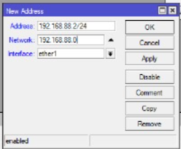
9. Buka terminal baru dan jalankan perintah 'ping 192.168.88.254'. Pastikan berhasil melakukan ping ke IP tersebut.

10. Buka 'Bridge' dari sidebar dan klik tanda plus untuk menambahkan bridge baru. Berikan nama 'bridge1' dan klik apply.
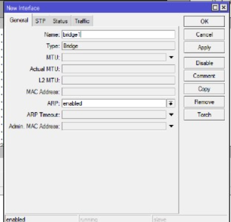
11. Pindah ke tab Ports, klik tanda plus. Kemudian pada Bridge Port, setting interface di ether2 dan Bridge di bridge1. Lakukan hal yang sama pada ether3, ether4, dan ether5.	
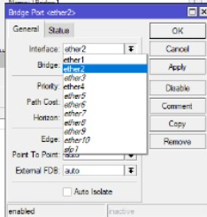
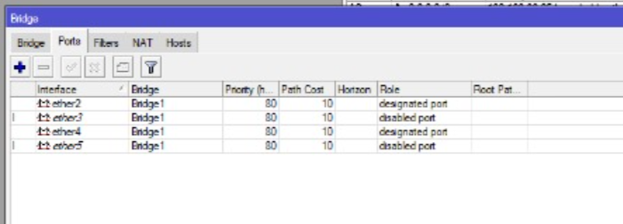	
12. Tambahkan ether2 sebagai address baru. Masukkan address 192.168.2.1/24 dan network 192.168.2.0, klik apply.
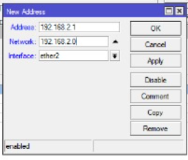
13. Setting gateway dari sidebar 'IP', kemudian pilih route dan klik tanda plus untuk add route. Masukkan 0.0.0.0 untuk destination address dan 192.168.88.254 untuk gateway. Klik apply untuk menerapkan/menambahkan.
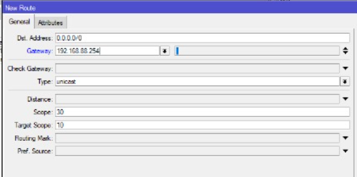
14. Setting DHCP dari sidebar 'IP', pilih DHCP server. Pada DHCP Setup pilih bridge1 di DHCP Server Interface, ubah Set Addresses menjadi 192.168.2.200-192.168.2.254. Jika sudah, hasil pengubahan disimpan.
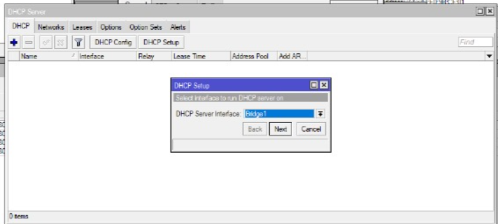
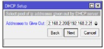
15. Buka IP pilih DNS. Tambahkan DNS dengan alamat PENS yaitu 202.9.85.4
16. Terakhir setting firewall dari sidebar 'IP'. Pilih NAT dan klik tanda plus. Masukkan source addressnya 192.168.2.0/24 dan destination addressnya 0.0.0.0. Klik apply untuk menyimpan.
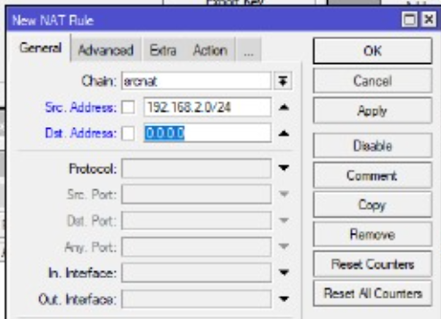
16. Mikrotik akan terhubung.

